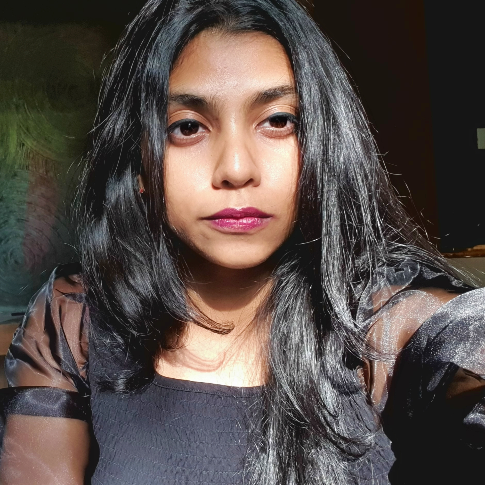
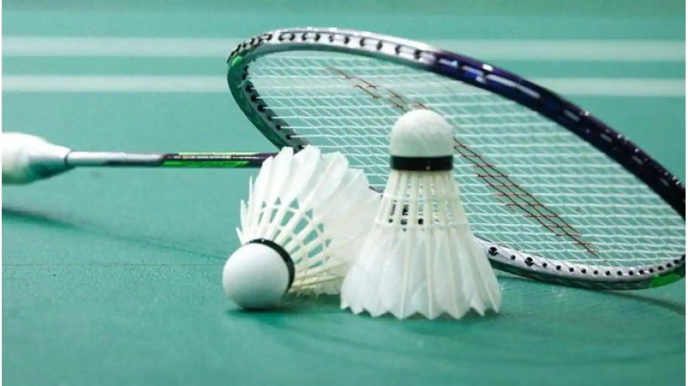

# Krishnaveni Unnikrishnan

***
I am **Krishnaveni Unnikrishnan**. I am from Bangalore, Karnataka. I was born in Calicut,Kerala. Right now I am pursuing my ***Bachelors degree in Computer science*** at Indian Institute of Technology, Goa.
My hobbies include playing badminton, swimming and reading novels.

***

## Education

| Year of graduation |           Degree            |                         Institution |
| :----------------- | :-------------------------: | ----------------------------------: |
| 2024               |          B. Tech.           | Indian Institute of Technology, Goa |
| 2019               | 12th standard or equivalent |          Pana PU College, Mangalore |
| 2017               | 10th standard or equivalent |                     NCFE, Bangalore |

***

## Second Year Courses @ IIT Goa

### Autumn 2021-22

- **CS210** : Digital System Design by *Dr. Neha Karanjkar*  [link](https://nehakaranjkar.github.io/cs210.html)
- **CS220**: Data Structures and Algorithm by *Dr. Sreejith* [link](https://www.iitgoa.ac.in/~sreejithav/21Aug/cs220.html)
- **CS221** : Discrete Mathematics by *Dr. Saurabh Trivedi*
- **CS230** : Probability and Statistics by *Dr. Satyanath Bhat*
- **HS221** : Economics by *Dr. Sunil Paul*

### Spring 2021-22
1. *CS222* : Algorithm design by <u>Dr Rahul CS</u>
2. *CS211*: Computer Architecture by <u>Dr. Sharad Sinha</u>
3. *CS415* : Modelling and Simulation of DES by <u>Dr. Neha Karanjkar</u>
4. *CS440* : Computer Graphics by <u>Dr. Venkatesh Kamat</u>
5. *CS102* : Software Tools by <u>Dr Clint George</u> [link](https://clintpgeorge.github.io/cs-102/spring-2022/)

***
## Hobbies

I love Playing Badminton, Click the photo to read some intersting facts about badminton

Here are some badminton tournaments I played in and the medals I recieved:

| Competetion                  |  Medal |
| :--------------------------- | -----: |
| VK Sports Club Women Singles |   Gold |
| IIT Goa Women's Singles      | Silver |
| IIT Goa Women's Doubles      | Bronze |